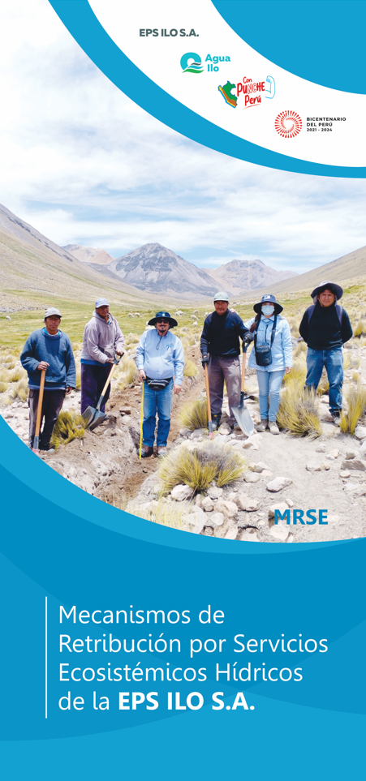
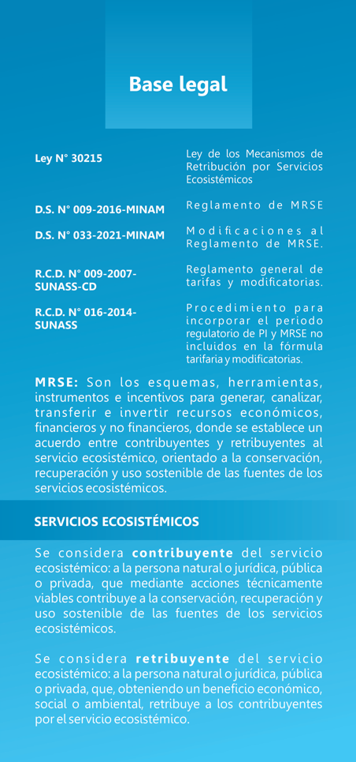
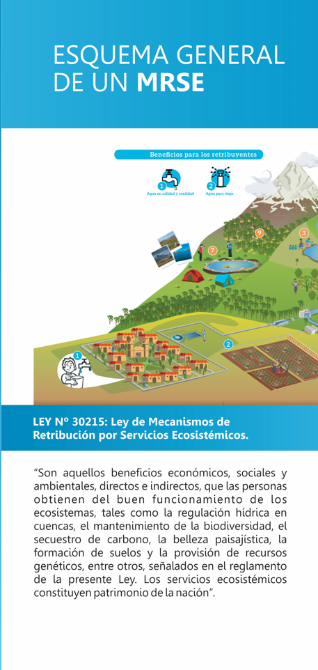
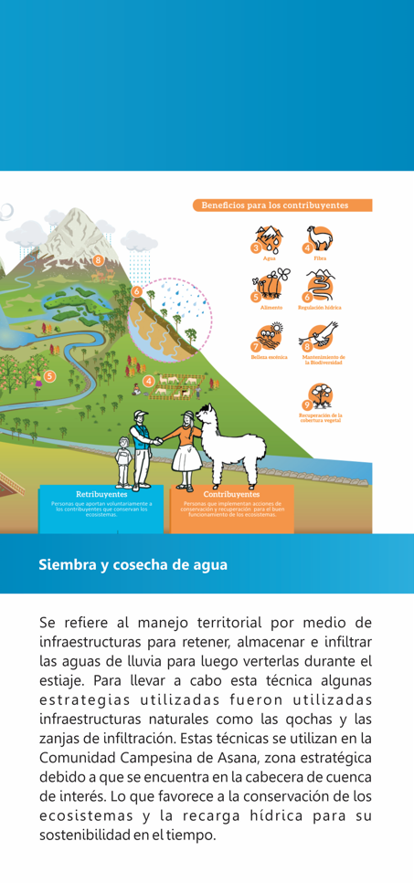
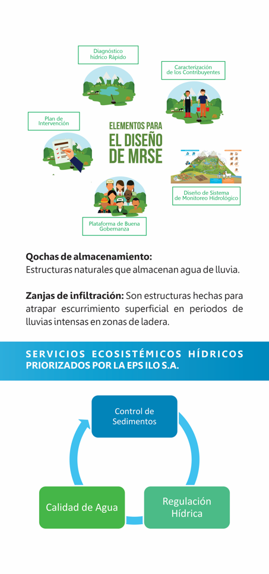
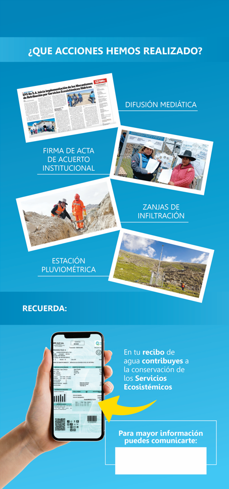
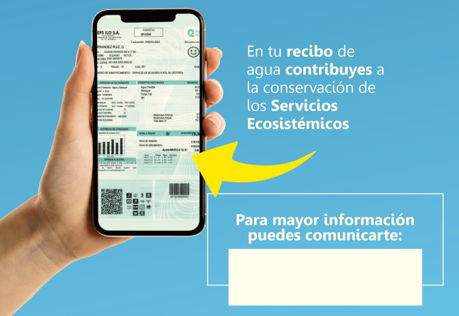

```{r setup, include=FALSE, warning=FALSE, message=FALSE}
knitr::opts_chunk$set(echo = FALSE, fig.align = "center")
library(flexdashboard)
library(tidyverse)
library(plotly)
library(leaflet)
library(leafem)
library(magick)
library(DT)
library(sf)
library(xaringanExtra)
library(xaringan)
library(openair)
library(openxlsx)
library(ggpubr)
library(xaringanthemer)
library(thematic)

theme_set(theme_bw())
```

# Datos estadísticos {data-icon="fa-chart-bar"}

## Column {style="color:cream" data-width="300"}

> ***MRSE Hídricos de la EPS Ilo S.A.***
>
>EPS Ilo S.A. realiza implementación del Plan de Intervención los MRSE en la Comunidad Campesina de Asana con la finalidad de conservación y recuperación de los Servicios Ecosistemos Hídricos.
>
>
> ***Bienvenido a esta plataforma de acceso público***

> --- ***Equipo MRSE***

## Column {.tabset data-width="550"}

```{r}
df <- read.csv("abril.csv")[,-1]
df$Fecha <- as.POSIXct(df$Fecha,format="%Y-%m-%d %H:%M")

g0 <- df %>% ggplot(aes(x=factor(Precipitacion)))+
  geom_histogram(color="black",fill="black", stat = "count", alpha=0.5)+
  labs(x="Categorías de precipitación (mm)",
       y="Conteos",
       subtitle = "Estación automática con intervalo de registro de 10 minutos",
       caption = "Fuente: EPS ILO S.A.")+
  scale_y_continuous(sec.axis = sec_axis(~./length(df$Precipitacion),
                                         name = "Conteos (%)",
                                         labels = scales::percent,
                                         breaks = seq(0,1.2,0.2)))


datos <- datatable(df, extensions = 'Buttons',
          options = list(pageLength=1000,
                             autowidth = TRUE,
                         dom = 'Bfrtip',buttons = 
      list('copy', list(
        extend = 'collection',
        buttons = c('csv', 'excel', 'pdf'),
        text = 'Download'))),
          caption = "Tabla 1: Datos de la estación pluviométrica")

```

### ***Slide1***



### ***Slide 2***



### ***Slide 3***



### ***Slide 4***



### ***Slide 5***



### ***Slide 6***



## Column {data-width=550 style = "color:cream"}

### ÚLTIMAS NOTICIAS


### 

\`

## Column {data-width=110 style = "color:cream"}

### Presentación MRSE

```{r}
embed_xaringan(url = "https://qgis-apuntes.netlify.app",ratio="4:3")
```

```{r eval=FALSE}
ggplotly(p=g0,dynamicTicks = TRUE)
```

### UBICACIÓN DE LA MICROCUENCA ASANA

```{r eval=FALSE}
graf <- df %>% ggplot(aes(x=Fecha,y=Precipitacion))+
  geom_line(color="deepskyblue")+
  labs(x="Fecha",y="Precipitación (mm)") +
  theme_minimal()
ggplotly(graf, dynamicTicks = TRUE)
```

```{r warning=FALSE, message=FALSE}
im <- "https://www.epsilo.com.pe/uploads/Logos/nuevoLogoEpsilo2.png"
# foto de estación
img_01 <- paste0("<center></center>")

img_02 <- paste0("<center></center>")

inf <- data.frame(este=c(266582, 254797), norte=c(8057162,8049438)) %>% 
  st_as_sf(coords=c("este","norte"), crs=32719)

inf2 <- st_transform(inf,crs = 4326) %>% as.data.frame()

#im <- "https://www.epsilo.com.pe/uploads/Logos/nuevoLogoEpsilo2.png"
polig <- st_read("shp/microcuenca.shp")


# Forma con imagen local
pluv <- leaflet() %>% 
  addTiles() %>% 
  addProviderTiles(providers$Esri.WorldImagery) %>% 
  leafem::addLogo(im,src ="remote",
                                 url="https://www.epsilo.com.pe/",
                         position = "bottomright", width = 160,
                         height = 40) %>% 
  addMarkers(lat=-17.062286,lng=-70.520806,
             popup = paste(sep="<br>","<b>Lugar:</b>","Estación pluviométrica","<b>Latitud:</b>","-17.062286","<b>Longitud:</b>"
                           ,"-70.520806","<b>Imagen:</b>",img_01)) %>% 
  addCircleMarkers(lat=c(-17.062286,-17.630402),
                   lng=c(-70.520806,-71.335089), radius = 40,
                   color="deepskyblue") %>% 
  addMarkers(lat=-17.630402,lng=-71.335089,
             popup = paste(sep="<br>","<b>Lugar:</b>","EPS ILO S.A.","<b>Latitud:</b>","-17.630402","<b>Longitud:</b>",
                           "-71.19908","<b>Imagen:</b>",img_02)) %>% 
  addPolygons(data=st_transform(polig,crs = 4326),
              label = "Microcuenca Asana",
                popup = "Comunidad de Asana") %>% 
  setView(zoom = 10, lat = -17.062286,lng=-70.520806)
  

pluv
```

# Información procesada {data-icon="fa-chart-pie"}

## Column {data-width="100"}


>***Datos de Monitoreo Hidrológico en la Microcuenca de Asana***
>Como parte de la ejecución del Plan de Mecanismos de Retribución por Servicios Ecosistémicos Hídricos de la EPS Ilo S.A. se cuenta con un Sistema de Monitoreo Hidrológico. Parte de este sistema se muestra en esta página. Aquí puedes visualizar y descargar los datos que se vienen recolectando constantemente.
>
> ---***Equipo MRSE***

## Column {data-width="400"}

### Gráficos de barras

```{r}
df$date2 <- format(df$Fecha,format="%Y-%m")
df$date3 <- format(df$Fecha,format("%Y-%m-%d"))
df$date4 <- format(df$Fecha,format = "%d")

m <- aggregate(data=df,Precipitacion~date3, FUN = sum)
m2 <- m %>% ggplot(aes(x=date3,y=Precipitacion))+
  geom_bar(stat="identity",fill="turquoise")+
  labs(title="Precipitacion diaria acumulada",
        x="Fecha",y="Precipitación (mm)") + theme(axis.title = element_text(size = 7),
    axis.text.x = element_text(size = 7,
        angle = 90))

ggplotly(p=m2)
```

### Gráfico de cajas

```{r}
m$dateu <- as.Date(m$date3,format = "%Y-%m-%d")
m$datex <- format(m$dateu,format="%m")
m <- m[,c(4,2)]
names(m) <- c("Mes","Precipitacion")

a1 <- m %>% ggplot(aes(x=Mes,y=Precipitacion))+
  geom_boxplot(alpha=0.8,color="black",fill="whitesmoke")+labs(x = "Meses",color="Meses",fill="Meses")+
  geom_jitter(size=3,alpha=0.5,color="turquoise") + theme(legend.position = "none")
ggplotly(a1)
```

## Column {data-width="50"}

### Precipitación acumulada total

```{r}
valueBox(paste0(sum(df$Precipitacion, na.rm=T), " milímetros"), icon = "fa-pencil")
```

### Inicio de mediciones

```{r}
valueBox(min(df$Fecha), icon = "fa-pencil")
```

### Última dato descargado de la estación

```{r}
valueBox(max(df$Fecha), icon = "fa-pencil")
```

### Cantidad de meses colectadoss

```{r}
gauge(paste0(3, "meses"), min = 0, max = 12, 
      gaugeSectors(
  danger = c(0, 2), warning = c(3, 6), success = c(7, 10)
))
```

### Gráfico de tipo calendario

```{r}
df1 <- df
df1 <- df1[,1:2]
names(df1) <- c("date","pp")
calendarPlot(df1, pollutant = "pp",
             statistic = "sum",
             cols = "Blues",)
```

# Descarga de datos {data-icon="fa-chart-bar"}

## row {data-width="110" style="color:cream"}

### Descarga de datos de lluvia

La siguiente tabla se obtuvo luego de desacargar datos de precipitación de la Estación meteorológica Asana. El formato de la fecha de cada dato de precipitación se muestra en Año-Mes-Día Hora:Minuto. Además la tabla se puede descargar en varios formatos (revisar los botones de la tabla 1).

```{r}
datos
```

## row {data-width="300" style="color:cream"}

### Gráfico de serie de tiempo

```{r}
dfn <- df
names(dfn) <- c("date","pp")
view(dfn)
library(openair)

timeVariation(dfn, pollutant = "pp", 
              statistic = "mean",
              col = "turquoise",
              main="Comportamiento de lluvias en Estación Asana")

```
